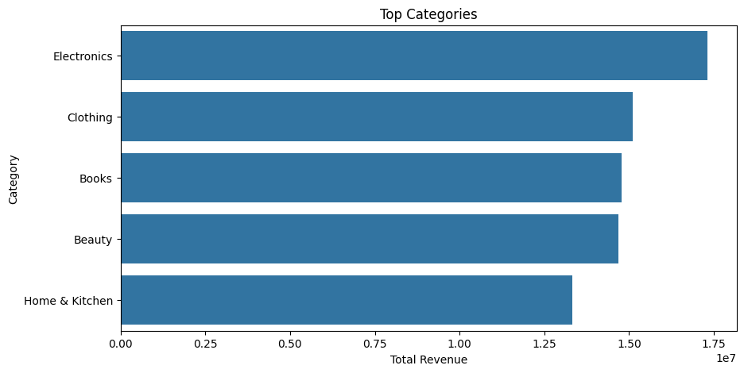

📊 Flipkart Sales Analysis
Project Overview
This project analyzes Flipkart sales data to uncover trends, customer behavior, and product performance. It includes exploratory data analysis (EDA), RFM (Recency, Frequency, Monetary) segmentation, and actionable insights to drive business strategy.

📈 Key Insights
1. Product Category Strategy
Electronics and Fashion dominate sales; Home & Kitchen shows growth potential.

📌 Recommendation: Introduce product bundling and cross-category promotions.

2. Customer Segmentation and Retention
High-Value Customers drive the most revenue.

📌 Recommendation: Implement loyalty programs and exclusive discounts.
3. Payment Behavior
High reliance on COD increases operational costs.
📌 Recommendation: Incentivize prepaid transactions with discounts or cashback.
4. Customer Ratings and Reviews
High ratings correlate with repeat purchases and higher order values.
📌 Recommendation: Highlight top-rated products and manage feedback actively.

